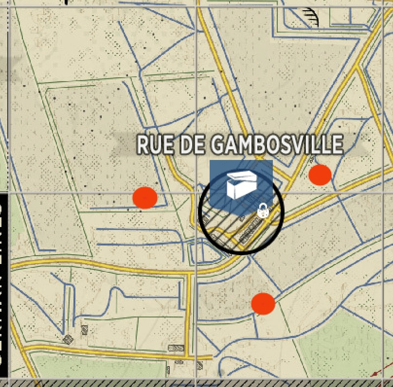

+++
title = "Garrison Development"
weight = 0
+++
Requires urgency and speed. Quickly choose and set pings for 3-4 locations to build garrisons all ~75 to 150 meters off
the strong point center. Place your OP at the middle of the strong point. If you have a squad of 6, send the AT and MG
players to defend current objective. Use the other 3 to rotate support role. Have one player take support first and
designate a second player NOT to deploy and wait on the deploy screen. Meet your support at the first location. Then
have support redeploy and the second player come in at the outpost. Run immediately to the next location while this is
happening and have the second support player meet you while the third support player redeploys and waits for their turn. 
Repeat until finished.

