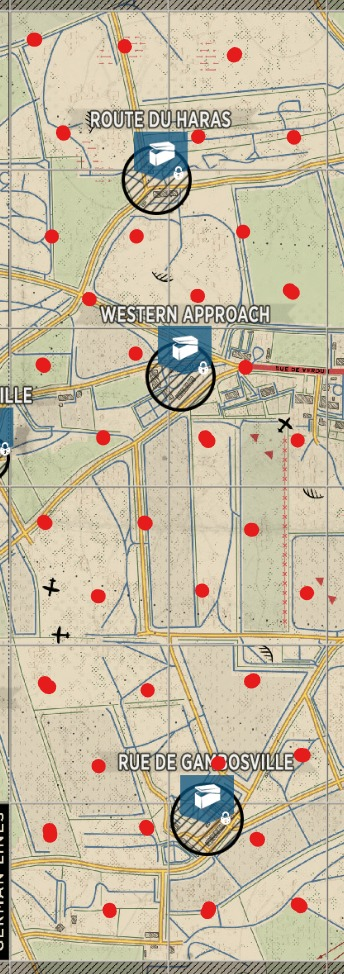

+++
title = "Red Zone Spawn Denial"
weight = 3
+++
The map is divided into 5 stages (1st, 2nd, 3rd, 4th, and 5th points) spanning 2 rows/columns across the map.
Each stage has 3 sectors (left/top, middle, and right/bottom) containing 4 grid squares.

This play focuses on defending the two sectors of the map stage where your strong point is NOT located. If your strong
point is an outside point, assign 4 squads of 2 players to the middle sector, and 2 squads of 2 players to the opposite
side sector. If your strong point is the middle sector, assign 3 squads of 2 players to each adjacent sector. Have
squads place their OPs in a triangle or box ~100m spread apart from the center of the sector. Maintain 1-2 people in
each grid square at all times continuously patroling around. This will not deny enemy from spawning on half tracks or
outposts, but it will lock out any red zone garrison attempts. Have 2 separate squads of 3 players to deploy around as
needed to support areas of engagement as identified.

<!-- Link to related strategies QRF Use, Flank Defense, and Last Stand -->
